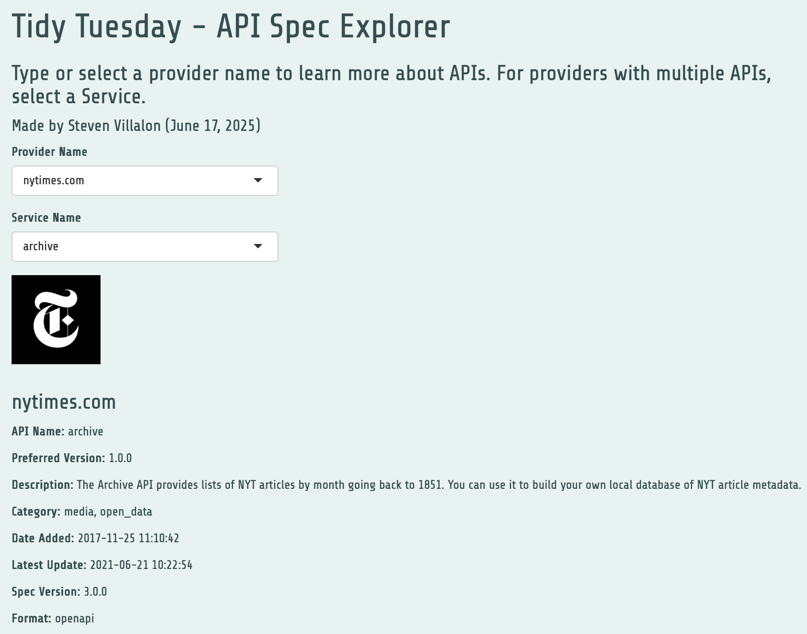

------------------------------------------------------------------------

::: preview-banner
<a href="https://stevenvillalon.shinyapps.io/2025-06-17-apis/" target="_blank">  </a>
:::

# Question of Interest

How do I make this data set easier to digest?

**Goal:** Make a Shiny app that would display a summary of information for a given API.

## 1. Packages & Dependencies

```{r packages, message = FALSE}
# Load packages
library(tidyverse)
library(tidytuesdayR)
library(here)
library(showtext)
library(ggtext)
library(scales)
library(shiny)

# Load helper functions
source(here::here("R/utils/tidy_tuesday_helpers.R"))

# Set project title
title <- "API Specs"
tt_date <- "2025-06-17"

```

## 2. Load Data

```{r data_load, message = FALSE}
# Load data from tidytuesdayR package
tuesdata <- tidytuesdayR::tt_load(tt_date)

# Extract elements from tuesdata
categories <- tuesdata$api_categories
info <- tuesdata$api_info
logos <- tuesdata$api_logos
origins <- tuesdata$api_origins
apisguru_apis <- tuesdata$apisguru_apis

# Remove tuesdata file
rm(tuesdata)

```

## 3. Examine Data

```{r data_headers}
# View data
head(categories)
head(info)
head(logos)
head(origins)
head(apisguru_apis)

```

## 4. Cleaning

```{r clean_categories}
# Flatten categories
categories_clean <- categories |> 
  group_by(name)  |> 
  summarize(apisguru_category = str_flatten(apisguru_category, collapse = ", "), .groups = "drop")

str(categories_clean)

```

```{r clean_apisguru_apis}
# Remove unnecessary columns
apisguru_apis_clean <- apisguru_apis |> 
  select(name, version, added, updated, openapi_ver) |> 
  rename(preferred_version = version)

str(apisguru_apis_clean)

```

```{r clean_info}
# Remove unnecessary columns
info_clean <- info |> 
  select(name, description, title, provider_name, service_name)

str(info_clean)

```

```{r clean_origins, warning = FALSE}
# Remove unnecessary columns
origins_clean <- origins |> 
  select(name, format, version) |> 
  rename(api_spec_version = version)

# Remove duplicate rows (multiple URLs)
origins_clean <- origins_clean |> 
    group_by(name) |> 
  mutate(row_is_min_or_na = if_else(
    n() > 1 & (is.na(api_spec_version) | api_spec_version == min(api_spec_version, na.rm = TRUE)),
    TRUE, FALSE
  )) |> 
  filter(!row_is_min_or_na | n() == 1) |> 
  select(-row_is_min_or_na) |> 
  ungroup()

str(origins_clean)

```

```{r clean_logos}
# Remove unnecessary columns
logos_clean <- logos |> 
  select(name, url)

str(logos_clean)

```

```{r joins}
# List tables to join
tables <- list(apisguru_apis_clean, categories_clean, info_clean, logos_clean, origins_clean)

# Inner join all 5 tables
df <- reduce(tables, inner_join, by = "name")

str(df)

```

```{r final_cleanup}
# Fill NAs in service_name column
df <- df |> 
  mutate(service_name = coalesce(service_name, title))

```

## 5. Export to CSV

```{r export_csv}
# Create CSV file
write_csv(df, "data/data_for_api_app.csv")

```

## 6. Session Info

::: {.callout-tip collapse="true" title="Expand for Session Info"}
```{r session_info, echo=FALSE, eval=TRUE, warning=FALSE}
sessionInfo()

```
:::
