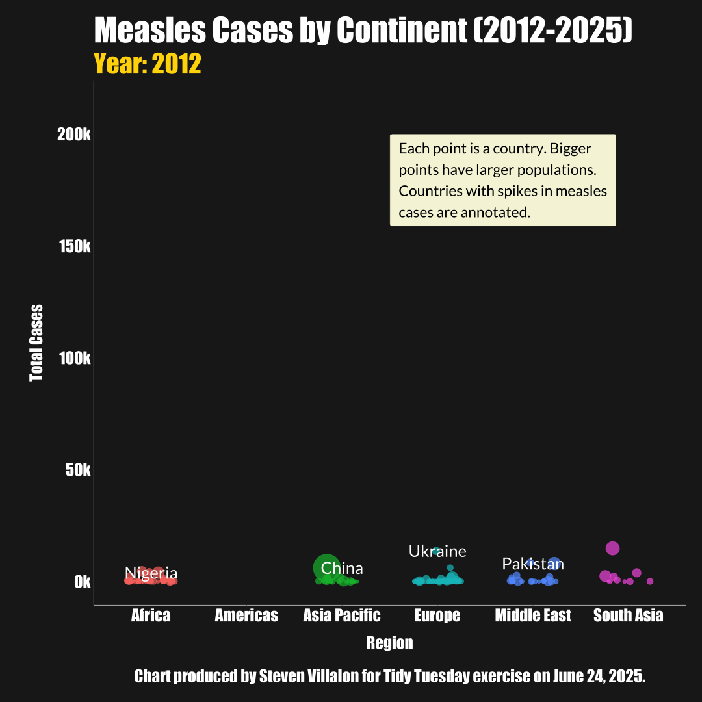

------------------------------------------------------------------------

{fig-alt="Final plot"}

# Question of Interest

How have measles cases changed over time?

**Goal:** Make an animated plot.

## 1. Packages & Dependencies

```{r packages, message = FALSE}
# Load packages
library(tidyverse)
library(tidytuesdayR)
library(here)
library(showtext)
library(sysfonts)
library(ggtext)
library(scales)
library(glue)
library(gganimate)
library(ggbeeswarm)

# Load helper functions
source(here::here("R/utils/tidy_tuesday_helpers.R"))

# Set project title
title <- "Measles Cases Worldwide"
tt_date <- "2025-06-24"

```

## 2. Load Data

```{r data_load, message = FALSE}
# Load data from tidytuesdayR package
tuesdata <- tidytuesdayR::tt_load(tt_date)

# Extract elements from tuesdata
cases_month <- tuesdata$cases_month
cases_year <- tuesdata$cases_year

# Remove tuesdata file
rm(tuesdata)

```

## 3. Examine Data

```{r data_headers}
# View data
head(cases_month)
head(cases_year)

```

## 4. Cleaning

```{r cleaning}
# Re-label regions and convert year to integer
df <- cases_year |>  
  mutate(region = recode(region,
    "AFRO"  = "Africa",
    "AMRO"  = "Americas",
    "EMRO"  = "Middle East",
    "EURO"  = "Europe",
    "SEARO" = "South Asia",
    "WPRO"  = "Asia Pacific"),
    year = as.integer(year)
    )
  
head(df)

```

## 5. Visualization

```{r visualization, fig.height = 3.6, fig.width = 3.6, dpi = 300, message = FALSE}

# Load fonts
font_add(family = "Impact", regular = "/Library/Fonts/Impact.ttf")
font_add(family = "Lato", regular = "/Library/Fonts/Lato-Regular.ttf")
showtext_auto()
showtext_opts(dpi = 300)

# Animated plot
p <- ggplot(df, aes(x = region, y = measles_total, color = region)) +
  scale_y_continuous(labels = label_number(scale = 1e-3, suffix = "k")) +
  geom_jitter(
    aes(size = total_population, group = country),
    position = position_jitter(width = 0.25, seed = 42),
    alpha = 0.7,
    show.legend = FALSE
  ) +
  scale_size(range = c(2, 20), guide = "none") +
  geom_text(
    data = df |>
      filter(country %in% c("China", "India", "Nigeria", "Pakistan", "Ukraine", "Brazil") | (country == "Madagascar" & year %in% c(2018, 2019, 2020))),
    aes(label = country, group = country),
    color = "white",
    size = 9,
    family = "Lato",
  ) +
  labs(
    title = "Measles Cases by Continent (2012-2025)",
    subtitle = "Year: {frame_time}",
    caption = "Chart produced by Steven Villalon for Tidy Tuesday exercise on June 24, 2025.",
    x = "Region",
    y = "Total Cases"
  ) +
  annotate(
    geom = "label",
    x = 3.5,
    y = 200000, 
    label = "Each point is a country. Bigger\npoints have larger populations.\nCountries with spikes in measles\ncases are annotated.",
    hjust = 0, 
    vjust = 1,
    fill = "beige",
    color = "black",
    size = 8,
    family = "Lato",
    label.padding = unit(0.5, "lines"),
    label.r = unit(0.1, "lines")
  ) +
  transition_time(year) +
  ease_aes("linear") +
  theme_classic(base_family = "Impact") +
  theme(
    plot.caption.position = "panel",
    plot.margin = margin(t = 25, b = 25, l = 25, r = 25),
    plot.background = element_rect(fill = "#1e1e1e", color = NA),
    plot.title = element_text(color = "white", size = 50, face = "bold", hjust = 0),
    plot.subtitle = element_text(color = "gold", size = 40, hjust = 0),
    plot.caption = element_text(color = "white", size = 25, hjust = 0.5),
    panel.background = element_rect(fill = "#1e1e1e", color = NA),
    axis.line = element_line(color = "gray70", size = 0.5),
    axis.title = element_text(color = "white", size = 25),
    axis.title.x = element_text(margin = margin(t = 20, b = 20)),
    axis.title.y = element_text(margin = margin(l = 20, r = 20)),
    axis.text.x = element_text(color = "white", size = 25),
    axis.text.y = element_text(color = "white", size = 25)
  )

# Display animation
animate(
  p,
  renderer = gifski_renderer(),
  fps = 10,
  duration = 15,
  width = 1080,
  height = 1080
)

```

## 6. Export GIF

```{r}
# Render animation
animate(
  p,
  renderer = gifski_renderer("output/2025-06-24_tidy_tuesday_measles.gif"),
  fps = 10,
  duration = 15,
  width = 1080,
  height = 1080
)

```

## 7. Session Info

::: {.callout-tip collapse="true" title="Expand for Session Info"}
```{r session_info, echo=FALSE, eval=TRUE, warning=FALSE}
sessionInfo()

```
:::
