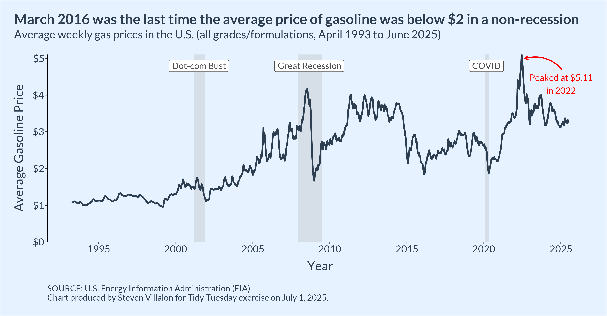

------------------------------------------------------------------------

{fig-alt="Final plot"}

# Question of Interest

How have gas prices changed over time?

**Goal:** Make a simple line plot.

## 1. Packages & Dependencies

```{r packages, message = FALSE}
# Load packages
library(tidyverse)
library(tidytuesdayR)
library(here)
library(showtext)
library(scales)

# Load helper functions
source(here::here("R/utils/tidy_tuesday_helpers.R"))

# Set project title
title <- "Weekly US Gas Prices"
tt_date <- "2025-07-01"

```

## 2. Load Data

```{r data_load, message = FALSE}
# Load data from tidytuesdayR package
tuesdata <- tidytuesdayR::tt_load(tt_date)

# Extract elements from tuesdata
weekly_gas_prices <- tuesdata$weekly_gas_prices

# Remove tuesdata file
rm(tuesdata)

```

## 3. Examine Data

```{r data_headers}
# View data
head(weekly_gas_prices)

```

## 4. Cleaning

```{r cleaning}
# Remove diesel and limit to only the "all" grade and formulation
df <- weekly_gas_prices |> 
  filter(fuel == "gasoline",
         grade == "all",
         formulation == "all")
  
head(df)

```

## 5. Visualization Parameters

```{r visualization_parameters}
# Create recession date ranges
recessions <- data.frame(
  start = as.Date(c("2001-03-01", "2007-12-01", "2020-02-01")),
  end   = as.Date(c("2001-11-30", "2009-06-30", "2020-04-30")),
  label = c("Dot-com Bust", "Great Recession", "COVID"),
  label_date = as.Date(c("2001-07-01", "2008-09-01", "2020-03-01")),  # middle
  label_y = c(4.8, 4.8, 4.8)
)

# Load fonts
font_add(
  family = "Lato",
  regular = "/Library/Fonts/Lato-Regular.ttf",
  bold = "/Library/Fonts/Lato-Bold.ttf"
)
showtext_auto()
showtext_opts(dpi = 300)

```

## 6. Visualization

```{r visualization, fig.height = 6.27, fig.width = 12, dpi = 300, message = FALSE}

# Make plot
final_plot <- ggplot(df) +
  aes(x = date, y = price) +
  
  # Shaded recession periods
  geom_rect(
    data = recessions, inherit.aes = FALSE,
    aes(xmin = start, xmax = end, ymin = -Inf, ymax = Inf),
    fill = "gray70", alpha = 0.3
  ) +
  
  # Price line
  geom_line(color = "#2c3e50", linewidth = 1.1) +
  
  # Recession labels
  geom_label(
    data = recessions, inherit.aes = FALSE,
    aes(x = label_date, y = label_y, label = label),
    family = "Lato", size = 4.5, fontface = "italic", color = "gray30"
  ) +
  
  # Annotation arrow
  annotate(
    "curve",
    x = as.Date("2025-02-01"), y = 4.7,
    xend = as.Date("2022-09-01"), yend = 5,
    curvature = 0.3,
    arrow = arrow(length = unit(0.02, "npc")),
    color = "red", linewidth = 0.8
  ) +
  
  # Annotation label
  annotate(
    "text",
    x = as.Date("2025-01-01"), y = 4.3,
    label = "Peaked at $5.11\nin 2022",
    family = "Lato", size = 4.5,
    color = "red", hjust = 0.5
  ) +
  
  # Axes
  scale_x_date(
    breaks = as.Date(c(
      "1990-01-01", "1995-01-01", "2000-01-01", "2005-01-01",
      "2010-01-01", "2015-01-01", "2020-01-01", "2025-01-01"
    )),
    date_labels = "%Y"
  ) +
  scale_y_continuous(
    breaks = 0:5,
    limits = c(0, NA),
    expand = c(0, 0),
    labels = scales::label_dollar()
  ) +
  
  # Labels
  labs(
    title = "March 2016 was the last time the average price of gasoline was below $2 in a non-recession",
    subtitle = "Average weekly gas prices in the U.S. (all grades/formulations, April 1993 to June 2025)",
    caption = "\nSOURCE: U.S. Energy Information Administration (EIA)\nChart produced by Steven Villalon for Tidy Tuesday exercise on July 1, 2025.",
    x = "Year",
    y = "Average Gasoline Price"
  ) +
  
  # Theme
  theme_classic(base_family = "Lato") +
  theme(
    plot.title.position = "plot",
    plot.margin = margin(t = 20, r = 20, b = 20, l = 20),
    plot.background = element_rect(fill = "#e6f2ff"),
    panel.background = element_rect(fill = "#e6f2ff", color = NA),
    plot.title = element_text(size = 20, face = "bold", color = "#2c3e50"),
    plot.subtitle = element_text(size = 16, color = "#2c3e50", margin = margin(b = 20)),
    plot.caption = element_text(size = 12, color = "#2c3e50", hjust = 0),
    axis.title = element_text(size = 18, color = "#2c3e50"),
    axis.title.x = element_text(margin = margin(t = 10)),
    axis.title.y = element_text(margin = margin(r = 10)),
    axis.text = element_text(size = 14, color = "#2c3e50")
  )

#final_plot

```

## 7. Export File

```{r file_export}
# Select file formats to export to
formats_to_export <- c("png", "svg")

# Save files to the output folder (uses custom R script)
save_tt_plots(
  plot = final_plot, 
  title = title, 
  date = tt_date,
  output_folder = "output", 
  formats = formats_to_export, 
  height = 6.27,
  width = 12,
  dpi = 300
  )

```

## 8. Session Info

::: {.callout-tip collapse="true" title="Expand for Session Info"}
```{r session_info, echo=FALSE, eval=TRUE, warning=FALSE}
sessionInfo()

```
:::

## 9. Github

::: {.callout-tip title="Files"}
📓 `<a href="https://github.com/stevenvillalon/portfolio/blob/main/TIDYTUESDAY/2025-07-01-GASOLINE/2025-07-01_tidy_tuesday_gasoline_O.qmd"`{=html}View the notebook</a>

📁 <a href="https://github.com/stevenvillalon/portfolio/tree/main/TIDYTUESDAY" target="_blank" rel="noopener noreferrer">Full Repository</a>
:::
