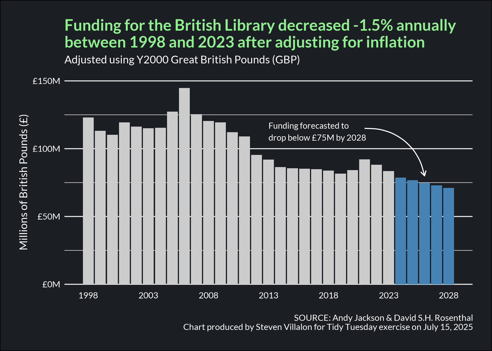

------------------------------------------------------------------------

{fig-alt="Final plot"}

# Question of Interest

What will funding look like in 5 years based on current trends?

**Goal:** Create a forecast to predict funding in 2028.

## 1. Packages & Dependencies

```{r packages, message = FALSE}
# Load packages
library(tidyverse)
library(tidytuesdayR)
library(here)
library(showtext)
library(scales)
library(tsibble)
library(forecast)
library(prophet)

# Load helper functions
source(here::here("R/utils/tidy_tuesday_helpers.R"))

# Set project title
title <- "British Library"
tt_date <- "2025-07-15"

```

## 2. Load Data

```{r data_load, message = FALSE}
# Load data from tidytuesdayR package
tuesdata <- tidytuesdayR::tt_load(tt_date)

# Extract elements from tuesdata
bl_funding <- tuesdata$bl_funding

# Remove tuesdata file
rm(tuesdata)

```

## 3. Examine Data

```{r data_headers}
# View data
head(bl_funding)

```

## 4. Cleaning

```{r prophet_ts}
# Prophet requires a dataframe input; create a time series dataframe
df_ts <- bl_funding |> 
  select(year, total_y2000_gbp_millions) |> 
  arrange(year) |>
  mutate(year = as.Date(paste0(year, "-01-01"))) |> 
  rename(ds = year, y = total_y2000_gbp_millions)

df_ts

```

```{r avg_rate_return}
# Extract initial and final values
initial_value <- df_ts$y[1]
final_value <- df_ts$y[nrow(df_ts)]

# Number of years
n_years <- nrow(df_ts)

# Calculate average annual rate
aar <- (final_value / initial_value)^(1 / (n_years - 1)) - 1

# Format as percentage
percent_change <- scales::percent(aar, accuracy = 0.1)

# Print AAR
cat("Average Annual Rate of Change:", percent_change, "\n")

```

## 5. Model

```{r prophet_fit, message=FALSE}
# Fit prophet model
model <- prophet(df_ts,
                 yearly.seasonality = FALSE,
                 weekly.seasonality = FALSE,
                 daily.seasonality = FALSE,
                 n.changepoints = 10,
                 changepoint.prior.scale = 0.01  # <<-- THIS smooths the trend
)

# Forecast
df_forecast <- make_future_dataframe(model, periods = 5, freq = "year")
model_forecast <- predict(model, df_forecast)

```

## 6. Visualization Parameters

```{r visualization_parameters}
# Load fonts
font_add(
  family = "Lato",
  regular = "/Library/Fonts/Lato-Regular.ttf",
  bold = "/Library/Fonts/Lato-Bold.ttf"
)
showtext_auto()
showtext_opts(dpi = 300)

```

## 7. Visualization

```{r visualization}
# Convert model forecast column to date
model_forecast$ds <- as.Date(model_forecast$ds)

final_plot <- ggplot(df_ts) + 
  aes(x = ds, y = y) +
  geom_bar(stat = "identity", fill = "gray80") +
  geom_bar(data = (model_forecast |> filter(ds >= "2024-01-01")),
           stat = "identity",
             aes(x=ds, y = yhat),
             fill = "steelblue") + 
  scale_x_date(
    breaks = seq(as.Date("1998-01-01"), as.Date("2030-01-01"), by = "5 years"),
    date_labels = "%Y") +
  scale_y_continuous(limits = c(0,150),
                     labels = label_number(suffix = "M", prefix = "£", accuracy = 1)) +
  labs(title = paste("Funding for the British Library decreased", percent_change, "annually\nbetween 1998 and 2023 after adjusting for inflation"),
  subtitle = "Adjusted using Y2000 Great British Pounds (GBP)",
       y = "Millions of British Pounds (£)",
      caption = "\nSOURCE: Andy Jackson & David S.H. Rosenthal\nChart produced by Steven Villalon for Tidy Tuesday exercise on July 15, 2025",) +
  theme_minimal(base_family = "Lato") +
  theme(plot.title = element_text(size = 16, color = "#90EE90", face = "bold"),
        #plot.title.position = "plot",
        plot.subtitle = element_text(color = "white"),
        plot.caption = element_text(color = "white"),
        axis.title.x = element_blank(),
        axis.title.y = element_text(color = "white"),
        axis.text = element_text(color = "white"),
        axis.text.x = element_text(margin = margin(t = -5)),
        plot.background = element_rect(fill = "#1B1F23"),
        panel.grid.major.x = element_blank(),
        panel.grid.minor.x = element_blank(),
        plot.margin = margin(t = 20, r = 20, b = 20, l = 20)
) +
  
  annotate("curve",
           x = as.Date("2021-01-01"), y = 115,
           xend = as.Date("2026-01-01"), yend = 80,
           arrow = arrow(length = unit(0.2, "cm")),
           curvature = -0.4,
           color = "white") +
  
  annotate("text",
           x = as.Date("2013-01-01"), y = 112.5,
           label = "Funding forecasted to\ndrop below £75M by 2028",
           hjust = 0,
           family = "Lato",
           size = 3,
           color = "white")

final_plot

```

## 8. Export File

```{r file_export}
# Select file formats to export to
formats_to_export <- c("png", "svg")

# Save files to the output folder (uses custom R script)
save_tt_plots(
  plot = final_plot, 
  title = title, 
  date = tt_date,
  output_folder = "output", 
  formats = formats_to_export, 
  height = 5,
  width = 7,
  dpi = 300
  )

```

## 9. Session Info

::: {.callout-tip collapse="true" title="Expand for Session Info"}
```{r session_info, echo=FALSE, eval=TRUE, warning=FALSE}
sessionInfo()

```
:::

## 10. Github

::: {.callout-tip title="Files"}
📓 <a href="https://github.com/stevenvillalon/portfolio/blob/main/TIDYTUESDAY/2025-07-15-BRITISH.LIBRARY/2025-07-15_tidy_tuesday_british_library_O.qmd">View the notebook</a>

📁 <a href="https://github.com/stevenvillalon/portfolio/tree/main/TIDYTUESDAY" target="_blank" rel="noopener noreferrer">Full Repository</a>
:::

## Other

```{r time_series2, include=FALSE}
# Create time series
bl_ts <- bl_funding %>%
  select(year, total_y2000_gbp_millions) %>%
  tsibble(index = year)

plot(bl_ts, type = "l")

```

```{r arima_fit, include=FALSE}
# Fit ARIMA model
acf(bl_ts)
pacf(bl_ts)

fit <- auto.arima(bl_ts, seasonal = FALSE)
summary(fit)

```

```{r arima_diagnostics, include=FALSE}
# Check diagnostics
checkresiduals(fit)

```

```{r arima_forecast, include=FALSE}
# Forecast 5 periods ahead
fc <- forecast(fit, h = 5, level = 80)

```

```{r arima_visualiation1, include=FALSE}
# Plot forecast
autoplot(fc) +
  autolayer(fc$mean, series = "Forecast") +
  autolayer(fc$lower[,1], series = "Lower 80%", linetype = "dashed") +
  autolayer(fc$upper[,1], series = "Upper 80%", linetype = "dashed") +
  labs(title = "Forecast of Total Funding for the British Library",
       subtitle = "Adjusted for Inflation (Y2000 British Pounds)",
       x = "Year",
       y = "Value") +
  theme_classic() +
  theme(
    legend.position = "none"
  )

```

```{r arima_visualization2, include=FALSE}
# Add drift to ARIMA model
fit_drift <- Arima(bl_ts$total_y2000_gbp_millions, order = c(0,1,0), include.drift = TRUE)
fc2 <- forecast(fit_drift, h = 5)
autoplot(fc2)

```
