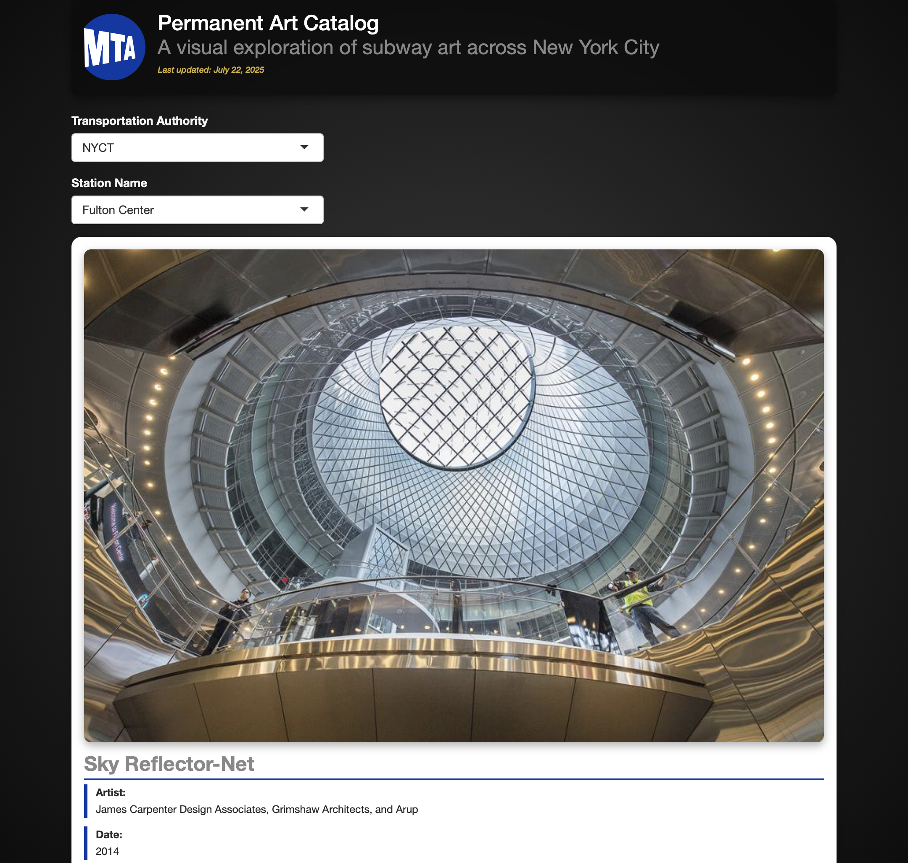

------------------------------------------------------------------------

::: preview-banner
<a href="https://stevenvillalon.shinyapps.io/2025-07-22-mta-art/" target="_blank"> {alt="Launch API Explorer App" style="border-radius: 12px; max- box-shadow: 0 0 10px rgba(0,0,0,0.2);"} </a>
:::

# Question of Interest

The [MTA has a dashboard to explore this dataset](#0), but the dashboard is at least partially broken. Can you recreate it in Shiny for R or Python?

**Goal:** Make a Shiny app that displays key information about each art installation.

## 1. Packages & Dependencies

```{r packages, message = FALSE}
# Load packages
library(tidyverse)
library(tidytuesdayR)
library(here)
library(rvest)

# Load helper functions
source(here::here("R/utils/tidy_tuesday_helpers.R"))

# Set project title
title <- "MTA Art in NYC"
tt_date <- "2025-07-22"

```

## 2. Load Data

```{r data_load, message = FALSE}
# Load data from tidytuesdayR package
tuesdata <- tidytuesdayR::tt_load(tt_date)

# Extract elements from tuesdata
mta_art <- tuesdata$mta_art
station_lines <- tuesdata$station_lines

# Remove tuesdata file
rm(tuesdata)

```

## 3. Examine Data

```{r data_headers}
# View data
head(mta_art)
head(station_lines)

```

## 4. Cleaning

```{r image_extraction_test}
# Test: Extract image URLs from  art image link
page <- read_html(mta_art$art_image_link[1])

# Select main image
img_url <- page |>
  html_element("img") |>      # Find main  tag
  html_attr("src")            # Extract src attribute

img_url

```

```{r image_extraction_function}
# Define function to extract image URLs from  art image link
get_art_image_url <- function(page_url) {
  tryCatch({
    page <- read_html(page_url)
    img_node <- page |> html_element("img")
    img_src <- img_node |> html_attr("src")

    # If no src found, return NA
    if (is.na(img_src) || img_src == "") return(NA)

    # If it's a relative path, prepend base URL
    if (!startsWith(img_src, "http")) {
      img_src <- paste0("https://new.mta.info", img_src)
    }

    return(img_src)
  }, error = function(e) {
    
    # If anything goes wrong (404, etc.), return NA
    return(NA)
  })
}

```

```{r image_extraction_for_all}
# Grab the image URLs for each piece and append to dataframe
mta_art$art_img_direct <- sapply(mta_art$art_image_link, get_art_image_url)

```

```{r text_cleaning}
# Clean text for default item in my app
mta_art$art_description[mta_art$art_title == "Sky Reflector-Net"] <- "Sky Reflector-Net is an integrated artwork by James Carpenter Design Associates, Grimshaw Architects, and ARUP, designed specifically for the Fulton Center. The monumental sculpture embraces light and air, creating a distinctive focal point within Lower Manhattan’s urban fabric. Suspended within the atrium's conical form, Sky Reflector-Net is composed of 112 tensioned cables, 224 high-strength rods, and nearly 10,000 stainless steel components. Attached to the soaring cable-net are 952 perforated optical aluminum panels that distribute year-round daylight and bring the sky down into the lower levels of the Center. The artwork combines beauty and function, reduces energy consumption by 30 percent, and powerfully connects the 300,000 daily transit users with a sense of daylight that will be constantly changing. According to Carpenter, “The artwork merges the human and social activity of the Fulton Center with a transcendent experience of New York City’s extraordinary skies, subtly connecting daily transit users’ passage through the city’s subterranean network with the daily and seasonal rhythms of the sky.” Visible from the corner of Broadway and Fulton Street, Sky Reflector-Net acts as a primary defining element for the Fulton Center — the powerful influence of natural light on our concept of the time of day, on the changes in the seasons, and the passing of years. It is also a key element in the creation of a renewed sense of place for Lower Manhattan."

# Review updated text
mta_art$art_description[mta_art$art_title == "Sky Reflector-Net"]

```

## 5. Export to CSV

```{r export_csv}
# Save dataframe to file
write.csv(mta_art, "data/mta_art.csv", row.names = FALSE)

```

## 6. Session Info

::: {.callout-tip collapse="true" title="Expand for Session Info"}
```{r session_info, echo=FALSE, eval=TRUE, warning=FALSE}
sessionInfo()

```
:::
