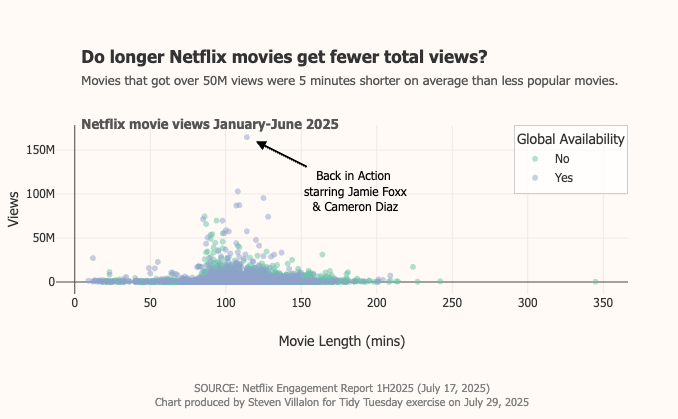

------------------------------------------------------------------------



# Question of Interest

What is the relationship between movie runtime and total views.

**Goal:** Create an interactive scatterplot to show the relationship.

## 1. Packages & Dependencies

```{r packages, message = FALSE}
# Load packages
library(tidyverse)
library(tidytuesdayR)
library(here)
library(showtext)
library(scales)
library(plotly)
library(htmlwidgets)
library(webshot2)

# Load helper functions
source(here::here("R/utils/tidy_tuesday_helpers.R"))

# Set project title
title <- "Netflix"
tt_date <- "2025-07-29"

```

## 2. Load Data

```{r data_load, message = FALSE}
# Load data from tidytuesdayR package
tuesdata <- tidytuesdayR::tt_load(tt_date)

# Extract elements from tuesdata
movies <- tuesdata$movies
shows <- tuesdata$shows

# Remove tuesdata file
rm(tuesdata)

```

## 3. Examine Data

```{r data_headers}
# View data
head(movies)

```

## 4. Functions

```{r functions}
# Define function to pull top 10 by report
top_10_movies <- function(df, period) {
  # code block
  result <- df |> 
    filter(report == period) |> 
    slice_max(order_by = views, n = 10) |> 
    select(title, views)
  return(result)
}
 
format_millions <- function(x) {
  paste0(round(x / 1e6, 1), "M")
}

```

## 5. Exploration

```{r exploration}
reports <- unique(movies$report)

top10s <- lapply(reports, function(i) {
  df <- top_10_movies(movies, i)
  df$report_period <- i  # Add a column with the report name
  df
})
names(top10s) <- reports

top10s

```

## 6. Cleaning

```{r cleaning}
# Remove rows with NAs
# Remove movies with the title that includes terms like Season X, Film Series, or Limited Series
# Change runtime to minutes
movies_clean <- movies |> 
  filter(!is.na(views),
         !str_detect(title, "Season\\s\\d+|Film Series|Limited Series"),
         report == "2025Jan-Jun") |> 
  mutate(runtime_minutes = as.numeric(as.duration(runtime), units = "mins"))

movies_clean

```

```{r mean_runtimes}
# Mean Runtime for Movies >50M views
movies_clean %>%
  mutate(group = ifelse(views > 50000000, "Greater than 50M", "Less than 50M")) %>%
  group_by(group) %>%
  summarize(avg_runtime_mins = mean(runtime_minutes, na.rm = TRUE))

```

## 7. Visualization

```{r visualization, fig.width=10, fig.height=6}
# Calculate average views
avg_views <- mean(movies_clean$views)

# Make plot
p <- plot_ly(
  data = movies_clean,
  x = ~runtime_minutes,
  y = ~views,
  type = "scatter",
  mode = "markers",
  color = ~available_globally,
  text = ~paste0(title, "<br>Views: ", format_millions(views), "<br>Runtime Minutes: ", runtime_minutes),
  hoverinfo = "text",
  marker = list(opacity = 0.5)
) |> 
  # add_lines(
  #   x = ~range(runtime_minutes),
  #   y = avg_views,
  #   line = list(color = "#800000"),
  #   name = "Mean Views",
  #   inherit = FALSE
  # ) 
  # |> 
  
  # Layout
  layout(
    # Titles and axis labels
    title = list(
      text = paste0(
      "<b>Do longer Netflix movies get fewer total views?</b><br>",
      "<span style='display:inline-block; max-width:600px; font-size:13px; color:#555;'>",
      "Movies that got over 50M views were 5 minutes shorter on average than less popular movies.<br><br><b>Netflix movie views January-June 2025</b>",
      "</span>"
      ),
      x = 0.12,  # left-aligned with panel
      xanchor = "left"
    ),
    xaxis = list(title = "Movie Length (mins)"),
    yaxis = list(title = "Views"),
    
    # Font
    font = list(
      family = "Tahoma",
      size = 12,
      color = "#333"
    ),
    
    # Legend
    legend = list(
      title = list(text = "Global Availability"),
      x = 1,
      y = 1,
      xanchor = "right",
      yanchor = "top",
      bgcolor = "rgba(255, 255, 255, 0.7)",  # optional: semi-transparent background
      bordercolor = "#ccc",
      borderwidth = 1
    ),
    
    # Plot details
    margin = list(l = 50, r = 50, t = 125, b = 125),
    plot_bgcolor = "#fffaf5",
    paper_bgcolor = "#fffaf5",

    # Annotations
    annotations = list(
      # Average line
      # list(
      #   x = max(movies_clean$runtime_minutes),
      #   y = avg_views,
      #   text = paste0("Avg views: ", format_millions(avg_views)),
      #   xanchor = "right",
      #   yanchor = "bottom",
      #   showarrow = FALSE,
      #   font = list(color = "#800000")
      # ),
      
      # Arrow pointing to movie
      list(
        x = 120,
        y = 160000000,
        text = paste(
          movies_clean$title[movies_clean$views == max(movies_clean$views)],
          "\nstarring Jamie Foxx\n& Cameron Diaz"
        ),
        showarrow = TRUE,
        arrowhead = 2,
        ax = 100,
        ay = 50,
        arrowcolor = "black",
        font = list(size = 12, color = "black")
      ),
      
      # Caption
      list(
        text = "SOURCE: Netflix Engagement Report 1H2025 (July 17, 2025)<br>Chart produced by Steven Villalon for Tidy Tuesday exercise on July 29, 2025",
        x = 0.5,
        y = -0.5,
        xref = "paper",
        yref = "paper",
        showarrow = FALSE,
        xanchor = "center",
        yanchor = "top",
        font = list(size = 11, color = "gray")
        )
    )
  )

p

```

## 8. Export File

```{r file_export, message=FALSE}
saveWidget(p, file = "output/interactive_plot.html", selfcontained = TRUE)

# webshot2::webshot(
#   url = "output/interactive_plot.html",
#   file = "output/2025-07-29_tidy_tuesday_netflix.png",
#   vwidth = 1000,
#   vheight = 600,
#   delay = 5  # gives the browser time to render the Plotly widget
# )

```

## 9. Session Info

::: {.callout-tip collapse="true" title="Expand for Session Info"}
```{r session_info, echo=FALSE, eval=TRUE, warning=FALSE}
sessionInfo()

```
:::

## 10. Github

::: {.callout-tip title="Files"}
📓 <a href="https://github.com/stevenvillalon/portfolio/blob/main/TIDYTUESDAY/2025-07-15-BRITISH.LIBRARY/2025-07-29_tidy_tuesday_netflix_O.qmd">View the notebook</a>

📁 <a href="https://github.com/stevenvillalon/portfolio/tree/main/TIDYTUESDAY" target="_blank" rel="noopener noreferrer">Full Repository</a>
:::
