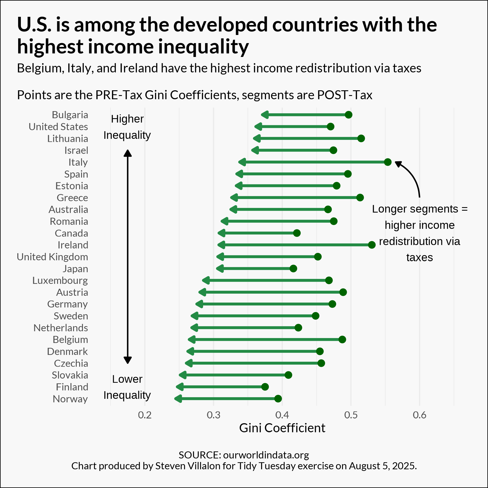

------------------------------------------------------------------------

{fig-alt="Final plot"}

# Question of Interest

Which countries have the highest and lowest Gini coefficients? Which countries have the highest income redistribution through taxes?

**Goal:** Create a segment plot to show the change in Gini coefficients PRE vs POST taxes.

## 1. Packages & Dependencies

```{r packages, message = FALSE}
# Load packages
library(tidyverse)
library(tidytuesdayR)
library(here)
library(showtext)
library(scales)
library(grid)

# Load helper functions
source(here::here("R/utils/tidy_tuesday_helpers.R"))

# Set project title
title <- "Inequality"
tt_date <- "2025-08-05"

```

## 2. Load Data

```{r data_load, message = FALSE}
# Load data from tidytuesdayR package
tuesdata <- tidytuesdayR::tt_load(tt_date)

# Extract elements from tuesdata
income_inequality_processed <- tuesdata$income_inequality_processed
income_inequality_raw <- tuesdata$income_inequality_raw

# Remove tuesdata file
rm(tuesdata)

```

## 3. Examine Data

```{r data_headers}
# View data
head(income_inequality_processed)
head(income_inequality_raw)

```

## 4. Cleaning

```{r cleaning}
# Remove NULLs and get average PRE/POST Gini for all years available
df <- income_inequality_processed |> 
  filter(!is.na(gini_mi_eq), !is.na(gini_dhi_eq)) |> 
  group_by(Entity) |> 
  summarize(mean_pre_tax_gini = mean(gini_mi_eq),
            mean_post_tax_gini = mean(gini_dhi_eq))

# Calculate difference between post and pre tax
df$difference <- round(df$mean_post_tax_gini - df$mean_pre_tax_gini, 2)

# Limit to 25 countries with greatest difference and convert Entity to factor
df <- df |> 
  slice_min(order_by = difference, n = 25) |> 
  mutate(Entity = fct_reorder(Entity, mean_post_tax_gini))

df

```

## 5. Visualization Parameters

```{r visualization_parameters}
# Load fonts
font_add(
  family = "Lato",
  regular = "/Library/Fonts/Lato-Regular.ttf",
  bold = "/Library/Fonts/Lato-Bold.ttf"
)
showtext_auto()
showtext_opts(dpi = 300)

```

## 6. Visualization

```{r visualization, fig.width=6, fig.height=6}

final_plot <- ggplot(df) +
  geom_segment(
    aes(x = mean_pre_tax_gini,
        xend = mean_post_tax_gini + 0.003,   # bump so the arrowhead shows
        y = Entity, yend = Entity),
    linewidth = 1.2, color = "#238B45",
    arrow = arrow(ends = "last", type = "closed", length = unit(5, "pt"))
  ) +
  
  geom_point(aes(x = mean_pre_tax_gini, y = Entity),
           shape = 21, size = 2.5, fill = "darkgreen", color = "darkgreen") +

  scale_x_continuous(limits = c(0.15, 0.65)) +
  
  labs(
    title = "U.S. is among the developed countries with the\nhighest income inequality",
    subtitle = "Belgium, Italy, and Ireland have the highest income redistribution via taxes\n\nPoints are the PRE-Tax Gini Coefficients, segments are POST-Tax",
    x = "Gini Coefficient",
    y = NULL,
    caption = "\nSOURCE: ourworldindata.org\nChart produced by Steven Villalon for Tidy Tuesday exercise on August 5, 2025."
  ) +
  
  theme_minimal(base_family = "Lato") +
  theme(
    legend.position = "none",
    plot.background = element_rect(fill = "#F8F8F8"),
    panel.background = element_rect(fill = "#F8F8F8", color = NA),
    panel.grid.major.y = element_blank(),
    plot.margin = margin(t = 15, r = 15, b = 15, l = 15),
    plot.caption.position = "plot",
    plot.caption = element_text(hjust = 0.5),
    plot.title = element_text(size = 18, face = "bold"),
    plot.title.position = "plot"
  ) +

  # === Up/down arrow annotation ===
  annotate(
    "segment",
    x = 0.175, xend = 0.175, y = "Israel", yend = "Czechia",
    arrow = arrow(ends = "both", type = "closed", length = unit(6, "pt")),
    linewidth = 0.6
  ) +
  annotate("text", x = 0.175, y = "Bulgaria", label = "Higher\nInequality",
           vjust = 1, size = 3.5) +
  annotate("text", x = 0.175, y = "Slovakia", label = "Lower\nInequality",
           vjust = 1, size = 3.5) +

  # === Curved arrow & label ===
  geom_curve(
    data = data.frame(x = 0.6, y = "Greece", xend = 0.565, yend = "Italy"),
    aes(x = x, y = y, xend = xend, yend = yend),
    curvature = 0.3,
    arrow = arrow(type = "closed", length = unit(5, "pt")),
    linewidth = 0.6,
    inherit.aes = FALSE
  ) +
  annotate("text", x = 0.6, y = "Canada",
           label = "Longer segments =\nhigher income\nredistribution via\ntaxes", size = 3.5)

#final_plot

```

## 7. Export File

```{r file_export}
# Select file formats to export to
formats_to_export <- c("png", "svg")

# Save files to the output folder (uses custom R script)
save_tt_plots(
  plot = final_plot, 
  title = title, 
  date = tt_date,
  output_folder = "output", 
  formats = formats_to_export, 
  height = 6,
  width = 6,
  dpi = 300
  )

```

## 8. Session Info

::: {.callout-tip collapse="true" title="Expand for Session Info"}
```{r session_info, echo=FALSE, eval=TRUE, warning=FALSE}
sessionInfo()

```
:::

## 9. Github

::: {.callout-tip title="Files"}
📓 <a href="https://github.com/stevenvillalon/portfolio/blob/main/TIDYTUESDAY/2025-08-05-INEQUALITY/2025-08-05_tidy_tuesday_inequality_O.qmd">View the notebook</a>

📁 <a href="https://github.com/stevenvillalon/portfolio/tree/main/TIDYTUESDAY" target="_blank" rel="noopener noreferrer">Full Repository</a>
:::
