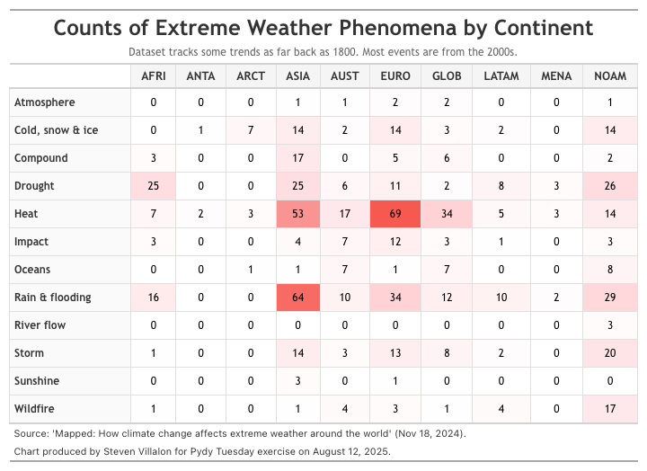

------------------------------------------------------------------------

{fig-alt="Final plot"}

## 1. Packages

```{python}
# Load packages
import pandas as pd
import numpy as np
import matplotlib.pyplot as plt
from great_tables import GT, md, loc, style
import session_info
import warnings

```

## 2. Load Data

```{python}
# Load data
attribution_studies = pd.read_csv('https://raw.githubusercontent.com/rfordatascience/tidytuesday/main/data/2025/2025-08-12/attribution_studies.csv')
attribution_studies_raw = pd.read_csv('https://raw.githubusercontent.com/rfordatascience/tidytuesday/main/data/2025/2025-08-12/attribution_studies_raw.csv')

```

## 3. Examine Data

```{python}
# Summary stats
attribution_studies.describe()

```

```{python}
# Get counts of event type
attribution_studies['event_type'].value_counts()

```

## 4. Cleaning

```{python}
# Pivot data
df_pivot = attribution_studies.pivot_table(index = 'event_type', 
                   columns = 'cb_region', 
                   values = 'event_name', 
                   aggfunc = 'count').round(0)

# Rename continents
df_pivot = df_pivot.rename(columns={
  'Antarctica':'ANTA',
  'Arctic': 'ARCT',
  'Australia and New Zealand': 'AUST',
  'Central and southern Asia': 'ASIA',
  'Eastern and south-eastern Asia': 'ASIA',
  'Europe': 'EURO',
  'Global': 'GLOB',
  'Latin America and the Caribbean': 'LATAM',
  'Northern Africa and western Asia': 'MENA',
  'Northern America': 'NOAM',
  'Northern hemisphere': 'GLOB',
  'Oceania': 'AUST',
  'Sub-Saharan Africa': 'AFRI'
}).copy()

# Collapse columns with same name
df_pivot = df_pivot.T.groupby(level=0).sum().T

# Set index of pivot table to event_type
df_reset = df_pivot.reset_index().rename(columns={"index": "event_type"}).copy()

```

## 5. Visualization

```{python message=FALSE}
# Set font
font_name = 'Trebuchet MS'

# Plot table
table = (
    GT(df_reset, rowname_col="event_type")
    .tab_header(
        title=md("**Counts of Extreme Weather Phenomena by Continent**"),
        subtitle="Dataset tracks some trends as far back as 1800. Most events are from the 2000s."
    )
    .fmt_number(
        columns=df_reset.columns[1:].tolist(),
        decimals=0
    )
    .data_color(
        columns=df_reset.columns[1:].tolist(),
        domain=[0, 75],
        palette=["#ffffff", "#ffcdd2", "#f44336"]  # White to light red to red gradient
    )
    
    # Body styling
    .tab_style(
        style=[
            style.text(font=font_name, size="12px"),
            style.borders(sides="all", color="#e0e0e0", weight="1px"),
            style.text(align="center")
        ],
        locations=loc.body()
    )
    
    # Column labels styling
    .tab_style(
        style=[
            style.text(font=font_name, weight="bold", size="13px"),
            style.fill(color="#f5f5f5"),
            style.text(align="center"),
            style.borders(sides="all", color="#e0e0e0", weight="1px")
        ],
        locations=loc.column_labels()
    )
    
    # Stub (row labels) styling
    .tab_style(
        style=[
            style.text(font=font_name, weight="bold", size="12px"),
            style.fill(color="#fafafa"),
            style.borders(sides="all", color="#e0e0e0", weight="1px")
        ],
        locations=loc.stub()
    )
    
    # Title styling
    .tab_style(
        style=[
            style.text(font=font_name, size="24px", weight="bold"),
            style.text(align="center")
        ],
        locations=loc.title()
    )
    
    # Subtitle styling
    .tab_style(
        style=[
            style.text(font=font_name, size="12px"),
            style.text(align="center", color="#666666")
        ],
        locations=loc.subtitle()
    )
    
    # Source notes
    .tab_source_note(
        source_note="Source: 'Mapped: How climate change affects extreme weather around the world' (Nov 18, 2024)."
    )
    
    .tab_source_note(
        source_note="Chart produced by Steven Villalon for Pydy Tuesday exercise on August 12, 2025."
    )
    
    # Table options for better spacing
    .tab_options(
        table_width="100%",
        table_font_size="12px"
    )
)

#table.show()

```

## 6. Export

```{python include=FALSE, echo=FALSE}
# Create a square version of table
square_table = (
    table
    .tab_options(
        table_width="700px",
        table_font_size="12px"
    )
)

#square_table.save("output/2025-08-12_tidy_tuesday_extreme_weather", expand=50)

```

## 7. Session Info

```{python}
# Show session and package info
warnings.filterwarnings("ignore", message="The '__version__' attribute is deprecated")
session_info.show()

```

## 8. Github

::: {.callout-tip title="Files"}
📓 <a href="https://github.com/stevenvillalon/portfolio/blob/main/TIDYTUESDAY/2025-08-12-EXTREME.INEQUALITY/2025-08-12_tidy_tuesday_extreme_weather_O.qmd">View the notebook</a>

📁 <a href="https://github.com/stevenvillalon/portfolio/tree/main/TIDYTUESDAY" target="_blank" rel="noopener noreferrer">Full Repository</a>
:::
