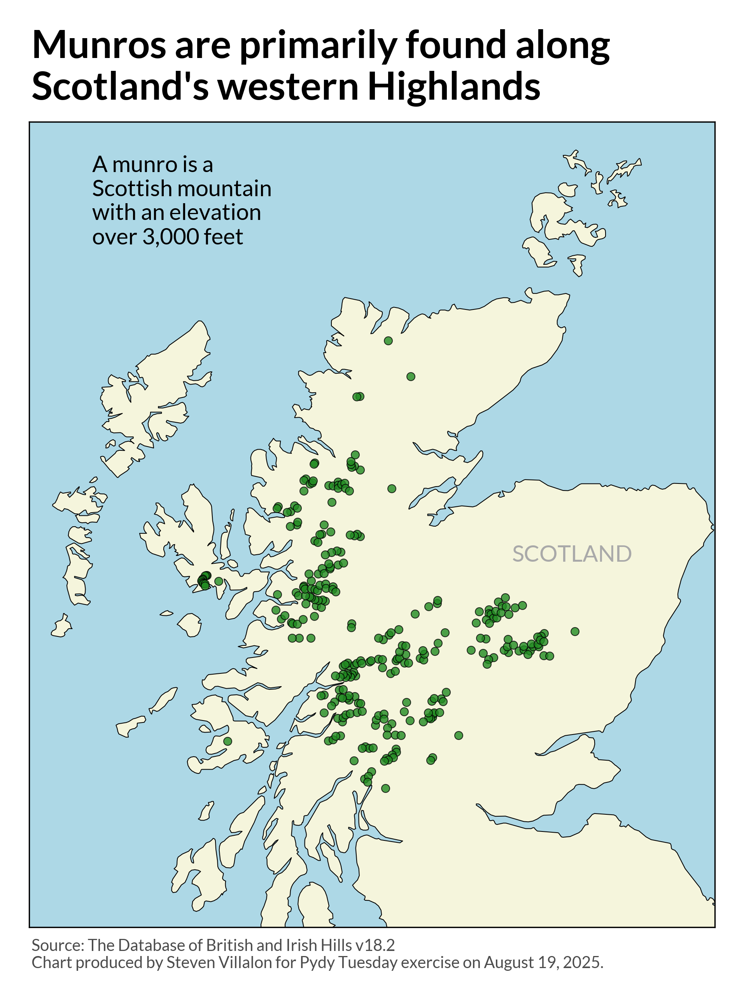

------------------------------------------------------------------------

{fig-alt="Final plot"}

## 1. Packages

```{python packages}
# Load packages
import pandas as pd
import numpy as np
import matplotlib.pyplot as plt
import warnings
import session_info
from pyproj import Transformer
import geopandas as gpd

```

## 2. Load Data

```{python load_data}
# Load data
scottish_munros = pd.read_csv('https://raw.githubusercontent.com/rfordatascience/tidytuesday/main/data/2025/2025-08-19/scottish_munros.csv',
encoding="latin-1")

```

## 3. Examine Data

```{python examine1}
# Summary stats
scottish_munros.describe()

```

```{python examine2}
# Get counts of event type
scottish_munros['2021'].value_counts()

```

## 4. Cleaning

```{python cleaning}
# Remove unnecessary columns and limit to just 2021 data
df = scottish_munros[['DoBIH_number', 'Name', 'Height_m', 'Height_ft', 'xcoord', 'ycoord', '2021']]

# Rename 2021 column     
df = df.rename(columns={"2021": "munro_type"})

# Drop NAs and limit to Munros only
df = df[df['munro_type'] == 'Munro'].dropna()

# Reset index
df = df.reset_index(drop=True)

df.head()

# Count NAs
# df['munro_type'].isna().sum()

```

```{python convert_lat_lon}
# Convert x/y to lat/lon
# Set up transformer: OSGB36 (EPSG:27700) -> WGS84 lat/lon (EPSG:4326)
transformer = Transformer.from_crs("epsg:27700", "epsg:4326", always_xy=True)

# Apply conversion
df["lon"], df["lat"] = transformer.transform(df["xcoord"].values, df["ycoord"].values)

```

## 5. Visualization

```{python visualization, message=FALSE, fig-width=8, fig-height=8}
# Set font
plt.rcParams['font.family'] = 'Lato'

# Load world data
world = gpd.read_file('https://naciscdn.org/naturalearth/10m/cultural/ne_10m_admin_0_countries.zip')

# Filter for UK
uk = world[world['NAME'] == 'United Kingdom']

# Create plot
fig, ax = plt.subplots(figsize=(8, 8))

# Set background color for water
ax.set_facecolor('lightblue')

# Plot UK map and set land color
map_plot = uk.plot(ax=ax, color='beige', edgecolor='black', linewidth=0.5)

# Plot munros as scatterplot
scatter_plot = ax.scatter(df['lon'], df['lat'], c='forestgreen', s=25, alpha=0.8, edgecolors='black', linewidth=0.5, label='Munros')

# Map boundary (Zoom in on Scotland)
xlim = ax.set_xlim(-7.75, -1.75)
ylim = ax.set_ylim(55.5, 59.5)

# Labels
main_title = plt.suptitle('Munros are primarily found along\nScotland\'s western Highlands', fontsize=24, fontweight='bold', y=0.98, ha='left', x=0.135)

inset = plt.figtext(0.2, 0.75, 'A munro is a\nScottish mountain\nwith an elevation\nover 3,000 feet', 
                       fontsize=14, ha='left')

country_name = plt.figtext(0.65, 0.41, 'SCOTLAND', 
                       fontsize=14, ha='left', color="darkgray")                       

caption = plt.figtext(0.135, -0.025, 'Source: The Database of British and Irish Hills v18.2\nChart produced by Steven Villalon for Pydy Tuesday exercise on August 19, 2025.', fontsize=10, ha='left', alpha=0.7)

ax.tick_params(left=False, bottom=False, labelleft=False, labelbottom=False)

plt.tight_layout()

```

## 6. Export

```{python include=FALSE, echo=FALSE}
# Save visualization as png
fig.savefig("output/2025-08-19_tidy_tuesday_scottish_munros.png",
            dpi=300,
            bbox_inches='tight',   
            pad_inches=0.25        
           )

# Close the figure to free memory
plt.close() 

```

## 7. Session Info

```{python}
# Show session and package info
warnings.filterwarnings("ignore", message="The '__version__' attribute is deprecated")
session_info.show()

```

## 8. Github

::: {.callout-tip title="Files"}
📓 <a href="https://github.com/stevenvillalon/portfolio/blob/main/TIDYTUESDAY/2025-08-19-SCOTTISH.MUNROS/2025-08-19_tidy_tuesday_scottish_munros_O.qmd">View the notebook</a>

📁 <a href="https://github.com/stevenvillalon/portfolio/tree/main/TIDYTUESDAY" target="_blank" rel="noopener noreferrer">Full Repository</a>
:::
