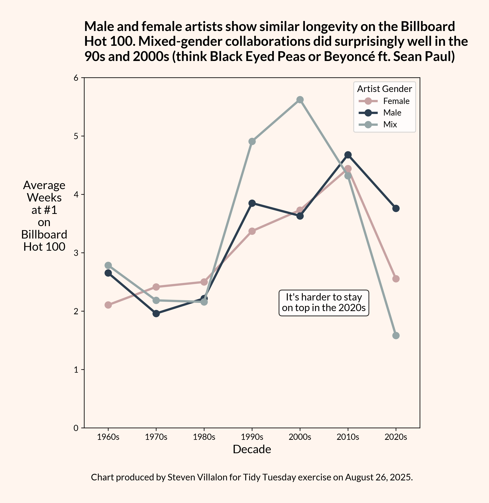

------------------------------------------------------------------------

{fig-alt="Final plot"}

## 1. Packages

```{python packages}
# Load packages
import pandas as pd
import numpy as np
import matplotlib.pyplot as plt
import seaborn as sns
import warnings
import session_info

```

## 2. Load Data

```{python load_data}
# Load data
billboard = pd.read_csv('https://raw.githubusercontent.com/rfordatascience/tidytuesday/main/data/2025/2025-08-26/billboard.csv')
topics = pd.read_csv('https://raw.githubusercontent.com/rfordatascience/tidytuesday/main/data/2025/2025-08-26/topics.csv')

```

## 3. Examine Data

```{python examine1}
# Summary stats
billboard.info()
billboard['weeks_at_number_one'].describe()

```

## 4. Cleaning

```{python cleaning1}
# Create decade column
# Convert date to datetime
billboard['date'] = pd.to_datetime(billboard['date'])

# Extract year
billboard['year'] = billboard['date'].dt.year

# Create decade column
billboard['decade'] = (billboard['year'] // 10) * 10

# Add an 's'
billboard['decade'] = billboard['decade'].astype(str) + "s"

```

```{python cleaning2}
mapping = {
    0: "Female",
    1: "Male",
    2: "Mix",
    3: "Non-binary"
}

billboard['artist_gender'] = billboard['artist_male'].map(mapping)

```

```{python exploration}
mixed_df = billboard[(billboard['artist_gender'] == "Mix") & (billboard['decade'] == '2000')]

mixed_df = mixed_df.sort_values('weeks_at_number_one', ascending=False)

mixed_df[['song', 'artist', 'decade', 'artist_gender']].head()

```

```{python cleaning3}
summary = billboard.groupby(['decade', 'artist_gender']).agg(
    n=('weeks_at_number_one', 'size'),
    mean_weeks=('weeks_at_number_one', 'mean')
).reset_index()

summary = summary[(summary['artist_gender'] != 'Non-binary') & (summary['decade'] != '1950s')].reset_index()

summary

```

## 5. Visualization

```{python visualization, echo=FALSE, fig.height=7, fig.width=8, message=FALSE, echo=FALSE}

# Set color mapping
color_mapping = {
    "Female": "#C7A2A2",  # Dusty rose
    "Male": "#2C3E50",    # Charcoal blue
    "Mix": "#95A5A6"    # Sophisticated gray
}

# Set font
plt.rcParams['font.family'] = 'Lato'

# Create plot
fig, ax = plt.subplots(figsize=(7, 8))
sns.pointplot(data=summary, x='decade', y='mean_weeks', hue='artist_gender', palette=color_mapping)

# Set y-axis to start at 0
ax.set_ylim(0, 6)

# Title and labels
plt.title('Male and female artists show similar longevity on the Billboard\nHot 100. Mixed-gender collaborations did surprisingly well in the\n90s and 2000s (think Black Eyed Peas or Beyoncé ft. Sean Paul)',
          fontsize=16, pad=20, loc='left', weight="bold")
plt.ylabel('Average\nWeeks\nat #1\non\nBillboard\nHot 100', fontsize=14, rotation=0, ha='center', labelpad=35)
plt.xlabel('Decade', fontsize=14)
plt.legend(title='Artist Gender', fontsize=10, title_fontsize=11)
ax.text(0.5, -0.15, 'Chart produced by Steven Villalon for Tidy Tuesday exercise on August 26, 2025.', 
        ha='center', fontsize=11, transform=ax.transAxes)

# Annotation
ax.annotate('It\'s harder to stay\non top in the 2020s',
            xy=(3,3),
            xytext=(4.5, 2),
            fontsize=12,
            ha='center',
            bbox=dict(boxstyle="round,pad=0.3", facecolor='white',
                     edgecolor='black', alpha=0.8))

# Styling
ax.set_facecolor('seashell')
fig.set_facecolor('seashell')
plt.subplots_adjust(bottom=0.12, left=0.15, right=0.95, top=0.85)
plt.show()

```

## 6. Export

```{python export, include=FALSE, echo=FALSE}
# Save visualization as png
fig.savefig("output/2025-08-26_tidy_tuesday_billboard.png",
            dpi=300,
            bbox_inches='tight',
            pad_inches=0.35

           )

# Close the figure to free memory
plt.close()

```

## 7. Session Info

```{python session_info}
# Show session and package info
warnings.filterwarnings("ignore", message="The '__version__' attribute is deprecated")
session_info.show()

```

## 8. Github

::: {.callout-tip title="Files"}
📓 <a href="https://github.com/stevenvillalon/portfolio/blob/main/TIDYTUESDAY/2025-08-26-BILLBOARD/2025-08-26_tidy_tuesday_billboard_O.qmd">View the notebook</a>

📁 <a href="https://github.com/stevenvillalon/portfolio/tree/main/TIDYTUESDAY" target="_blank" rel="noopener noreferrer">Full Repository</a>
:::
