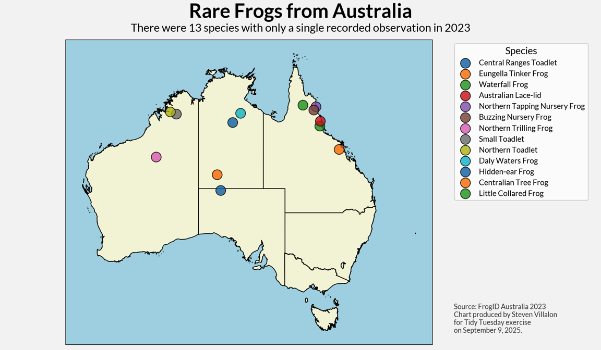

------------------------------------------------------------------------

{fig-alt="Final plot"}

## 1. Packages

```{python packages}
# Load packages
import pandas as pd
import numpy as np
import matplotlib.pyplot as plt
import seaborn as sns
import warnings
import session_info

```

## 2. Load Data

```{python load_data}
# Load data
frogID_data = pd.read_csv('https://raw.githubusercontent.com/rfordatascience/tidytuesday/main/data/2025/2025-09-02/frogID_data.csv')
frog_names = pd.read_csv('https://raw.githubusercontent.com/rfordatascience/tidytuesday/main/data/2025/2025-09-02/frog_names.csv')

```

## 3. Examine Data

```{python examine1}
# Summary stats
frog_names.info()
frogID_data.info()

```

## 4. Cleaning

```{python cleaning}
# Join datasets to get common names
df = frogID_data.merge(frog_names, on='scientificName', how='left')

# Find rare frog names
counts = df['scientificName'].value_counts()
rare_frogs = counts[counts == 1].index

# Filter df to only include rare frogs
df_rare = df[df['scientificName'].isin(rare_frogs)]

# Rename lat/lon
df_rare = df_rare.rename(columns={'decimalLongitude': 'lon',
                                  'decimalLatitude': 'lat'})

df_rare.head()

```

## 5. Visualization

```{python visualization}
#| echo: false
#| warning: false
#| fig-height: 7
#| fig-width: 12

import geopandas as gpd
import matplotlib.pyplot as plt
plt.rcParams['font.family'] = 'Lato'


# Load the Australia map shape
url = 'https://raw.githubusercontent.com/rowanhogan/australian-states/master/states.geojson'
aus_states = gpd.read_file(url)

# Show Australia map
fig, ax = plt.subplots(figsize=(12, 7), facecolor='#F5F5F5')
ax.set_facecolor('lightblue')
_ = aus_states.plot(ax=ax, edgecolor='black', facecolor='beige')

# Plot each frog with a different color
for idx, row in df_rare.iterrows():
    _ = ax.scatter(row['lon'], row['lat'], 
                   s=200, label=row['commonName'],
                   edgecolor='black', linewidth=1, alpha=0.8)

# Labels
_ = plt.text(0.5, 0.95, 'Rare Frogs from Australia', 
             fontsize=28, fontweight='bold', ha='center', transform=fig.transFigure)
_ = plt.text(0.5, 0.91, 'There were 13 species with only a single recorded observation in 2023', 
             fontsize=16, ha='center', transform=fig.transFigure)
_ = plt.legend(title='Species', bbox_to_anchor=(1.05, 1), loc='upper left', fontsize=11, title_fontsize=14)
_ = plt.figtext(0.755, 0.05, 'Source: FrogID Australia 2023\nChart produced by Steven Villalon\nfor Tidy Tuesday exercise\non September 9, 2025.', 
                ha='left', fontsize=10, color='#444444')
_ = ax.set_xticks([])
_ = ax.set_yticks([])
plt.tight_layout()
plt.show()

```

## 6. Export

```{python export, include=FALSE, echo=FALSE}
# Save visualization as png
# fig.savefig("output/2025-09-02_tidy_tuesday_frogs.png",
#             dpi=300,
#             #bbox_inches='tight',
#             pad_inches=0.35
#            )
# 
# # Close the figure to free memory
# plt.close()

```

## 7. Session Info

```{python session_info}
# Show session and package info
warnings.filterwarnings("ignore", message="The '__version__' attribute is deprecated")
session_info.show()

```

## 8. Github

::: {.callout-tip title="Files"}
📓 <a href="https://github.com/stevenvillalon/portfolio/blob/main/TIDYTUESDAY/2025-09-02-FROGS/2025-09-02_tidy_tuesday_frogs_O.qmd">View the notebook</a>

📁 <a href="https://github.com/stevenvillalon/portfolio/tree/main/TIDYTUESDAY" target="_blank" rel="noopener noreferrer">Full Repository</a>
:::
