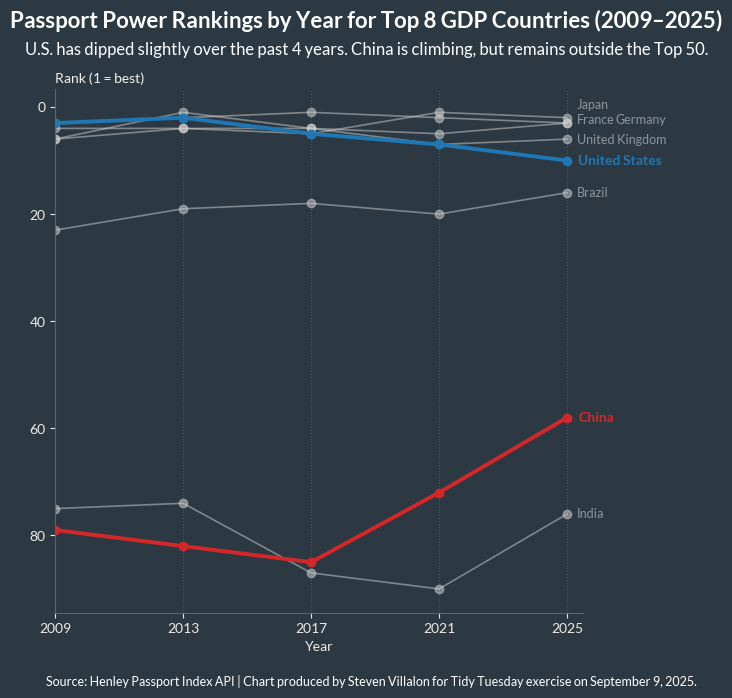

------------------------------------------------------------------------

{fig-alt="Final plot" width="524"}

## 1. Packages

```{python packages}
# Load packages
import pandas as pd
import numpy as np
import matplotlib.pyplot as plt
import seaborn as sns
import warnings
import session_info

```

## 2. Load Data

```{python load_data}
# Load data
country_lists = pd.read_csv("https://raw.githubusercontent.com/rfordatascience/tidytuesday/main/data/2025/2025-09-09/country_lists.csv")
rank_by_year = pd.read_csv("https://raw.githubusercontent.com/rfordatascience/tidytuesday/main/data/2025/2025-09-09/rank_by_year.csv")

```

## 3. Examine Data

```{python examine1}
# View data
country_lists.head()
rank_by_year.head()

```

```{python}
# Get year ranges
print(f'Rankings range from {rank_by_year.year.min()} to {rank_by_year.year.max()}.')

```

## 4. Cleaning

```{python cleaning}
# Years of interest (every 4 years)
years = list(range(2009, 2029, 4))

# List of Top GDP countries
top8_gdp = ["US", "CN", "JP", "DE", "IN", "GB", "FR", "BR"]

# Limit to years of interest
df = rank_by_year[rank_by_year["year"].isin(years)].sort_values(by=["code", "year"])

# Limit to Top GDP countries
df2 = df[df["code"].isin(top8_gdp)]
df2.info()

```

## 5. Visualization

```{python visualization}
#| echo: false
#| warning: false
#| fig-height: 8
#| fig-width: 8

import matplotlib.pyplot as plt
import seaborn as sns

# Set font and background colors
plt.rcParams["font.family"] = "Lato"
plt.rcParams["axes.labelcolor"] = "#EDEBE6"
plt.rcParams["xtick.color"] = "#EDEBE6"
plt.rcParams["ytick.color"] = "#EDEBE6"
plt.rcParams["text.color"] = "#F4F1EB"

# Countries of interest
highlight_countries = ["United States", "China"]
highlight_colors = {"United States": "#1f77b4", "China": "#d62728"}  # blue/red
base_color = "lightgray"

fig, ax = plt.subplots(figsize=(8, 8))

# Plot countries one by one
for country, g in df2.groupby("country"):
    g = g.sort_values("year")
    is_hi = country in highlight_countries
    ax.plot(
        g["year"],
        g["rank"],
        marker="o",
        linewidth=2.8 if is_hi else 1.2,
        alpha=1.0 if is_hi else 0.5,
        color=highlight_colors.get(country, base_color),
        zorder=3 if is_hi else 1,
    )

# Invert y so 1 is at the top
ax.invert_yaxis()

# Labels/colorsfor U.S. and China
for country in highlight_countries:
    g = df2[df2["country"] == country].sort_values("year")
    last = g.iloc[-1]
    ax.text(
        x=last["year"] + 0.35,
        y=last["rank"],
        s=country,
        color=highlight_colors[country],
        va="center",
        weight="bold",
        fontsize=10,
        zorder=4,
    )

# Other country labels
for country, g in df2.groupby("country"):
    if country in highlight_countries:
        continue
    last = g.sort_values("year").iloc[-1]
    x_offset, y_offset = 0.1, 0
    if country == "Japan":
        y_offset = -2.5
    elif country == "Germany":
        y_offset, x_offset = -0.75, 1.3
    elif country == "France":
        y_offset = -0.75
    ax.text(
        x=last["year"] + 0.2 + x_offset,
        y=last["rank"] + y_offset,
        s=country,
        va="center",
        fontsize=9,
        color="#9aa0a6",  # soft gray
        alpha=0.9,
    )

# X-axis with years of interest
ax.set_xticks(years)
ax.set_xlim(min(years), max(years) + 0.5)

# Grid
ax.grid(axis="x", linestyle=":", alpha=0.25)

# Titles
# Reserve space: top for titles, bottom for caption
plt.tight_layout(rect=[0.06, 0.12, 0.9, 0.84])  # [left, bottom, right, top]

# Now add titles/caption (centered)
plt.suptitle(
    "Passport Power Rankings by Year for Top 8 GDP Countries (2009–2025)",
    fontsize=16,
    weight="bold",
    y=0.92,
    color="white",
)
fig.text(
    0.5,
    0.87,
    "U.S. has dipped slightly over the past 4 years. China is climbing, but remains outside the Top 50.",
    ha="center",
    va="center",
    fontsize=12,
    color="white",
)
fig.text(
    0.1,
    0.08,
    "Source: Henley Passport Index API | Chart produced by Steven Villalon for Tidy Tuesday exercise on September 9, 2025.",
    ha="left",
    va="center",
    fontsize=9,
    color="white",
    family="Lato",
)

# Axis labels
ax.set_xlabel("Year")
ax.set_ylabel("")  # Remove the default rotated label
ax.spines["left"].set_color("#59656F")
ax.spines["bottom"].set_color("#59656F")

# Add a new horizontal label near the top-left corner
ax.text(
    x=min(years),  # position slightly before the first x-tick
    y=ax.get_ylim()[1] - 0.75,  # top of y-axis range
    s="Rank (1 = best)",
    ha="left",
    va="bottom",
    fontsize=10,
)

# Colors
fig.patch.set_facecolor("#2C3943")  # light gray-white
ax.set_facecolor("#2C3943")

# Display plot
sns.despine()
plt.show()

```

## 6. Export

```{python export, include=FALSE, echo=FALSE}
# Save visualization as png
fig.savefig("output/2025-09-09_tidy_tuesday_passports2.png",
            dpi=300,
            #bbox_inches='tight',
            pad_inches=0.35
           )

# Close the figure to free memory
plt.close()

```

## 7. Session Info

```{python session_info}
# Show session and package info
warnings.filterwarnings("ignore", message="The '__version__' attribute is deprecated")
session_info.show()

```

## 8. Github

::: {.callout-tip title="Files"}
📓 <a href="https://github.com/stevenvillalon/portfolio/blob/main/TIDYTUESDAY/2025-09-09-PASSPORTS/2025-09-09_tidy_tuesday_passports_O.qmd">View the notebook</a>

📁 <a href="https://github.com/stevenvillalon/portfolio/tree/main/TIDYTUESDAY" target="_blank" rel="noopener noreferrer">Full Repository</a>
:::
