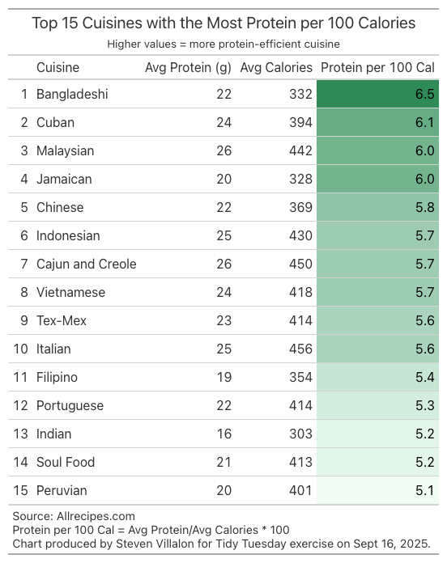

------------------------------------------------------------------------

{fig-alt="Final plot"}

## 1. Packages

```{python packages}
# Load packages
import pandas as pd
import numpy as np
import matplotlib.pyplot as plt
import warnings
import session_info
from great_tables import GT, md

```

## 2. Load Data

```{python load_data}
# Load data
all_recipes = pd.read_csv('https://raw.githubusercontent.com/rfordatascience/tidytuesday/main/data/2025/2025-09-16/all_recipes.csv')
cuisines = pd.read_csv('https://raw.githubusercontent.com/rfordatascience/tidytuesday/main/data/2025/2025-09-16/cuisines.csv')

```

## 3. Examine Data

```{python examine1}
# Preview data
print("All_recipes.csv")
all_recipes.head()

```

```{python examine2}
# Preview data
print("Cuisines.csv")
cuisines.head()

```

## 4. Cleaning

Unfortunately, the avg rating variable was not strongly correlated with any other variable. Focused attention on the cuisines data set because it has recipes by country.

```{python cleaning1}
 # Macros summary table grouped by cuisine
 avg_macros_by_cuisine = cuisines.groupby("country").agg(
    recipes=("carbs", "count"),
    avg_grams_carbs=("carbs", "mean"),
    avg_grams_fat=("fat", "mean"),
    avg_grams_protein=("protein", "mean"),
    avg_calories=("calories", "mean")
).reset_index().round(1)

```

```{python cleaning2}
# Calculate grams of protein per 100 calories
avg_macros_by_cuisine["protein_per_100_calories"] = (
    avg_macros_by_cuisine["avg_grams_protein"] / avg_macros_by_cuisine["avg_calories"] * 100
)

# Sorted list
best_protein_cuisines = avg_macros_by_cuisine.sort_values(
    "protein_per_100_calories", ascending=False
)

# Top 15 summary
summary = (
    best_protein_cuisines
    .assign(rank=lambda df: range(1, len(df) + 1))  # create rank column
    .loc[:, ["rank", "country", "avg_grams_protein", "avg_calories", "protein_per_100_calories"]]
    .head(15)
    .round(1)
)

```

## 5. Visualization

```{python visualization}
#| warning: false
#| fig-height: 8
#| fig-width: 8

summary_view = (
    summary
      .sort_values("protein_per_100_calories", ascending=False)
      .head(15)
      .reset_index(drop=True)
)

tbl = (
    GT(summary_view)
    .tab_header(
        title="Top 15 Cuisines with the Most Protein per 100 Calories",
        subtitle="Higher values = more protein-efficient cuisine"
    )
    .cols_label(
        rank="",
        country="Cuisine",
        avg_grams_protein="Avg Protein (g)",
        avg_calories="Avg Calories",
        protein_per_100_calories="Protein per 100 Cal"
    )
    .fmt_number(
        columns=["avg_grams_protein", "avg_calories"],
        decimals=0
    )
    .fmt_number(
        columns=["protein_per_100_calories"],
        decimals=1
    )
    .data_color(
        columns=["protein_per_100_calories"],
        palette=["#f0fdf4", "#2e8b57"]
    )
    .tab_source_note(md("Source: Allrecipes.com<br>Protein per 100 Cal = Avg Protein/Avg Calories * 100<br>Chart produced by Steven Villalon for Tidy Tuesday exercise on Sept 16, 2025."))
)

#tbl.show()

```

## 6. Export

```{python export}
#| warning: false
#| message: false

# Save visualization as png
_ = tbl.save(
    "output/2025-09-16_tidy_tuesday_recipes.png",
    selector="table",
    scale=1,
    expand=10,
    web_driver="chrome",
    window_size=(768, 768) # 8 inches × 96 dpi = 768 px
)

```

## 7. Session Info

```{python session_info}
# Show session and package info
warnings.filterwarnings("ignore", message="The '__version__' attribute is deprecated")
session_info.show()

```

## 8. Github

::: {.callout-tip title="Files"}
📓 <a href="https://github.com/stevenvillalon/portfolio/blob/main/TIDYTUESDAY/2025-09-16-PASSPORTS/2025-09-16_tidy_tuesday_passports_O.qmd">View the notebook</a>

📁 <a href="https://github.com/stevenvillalon/portfolio/tree/main/TIDYTUESDAY" target="_blank" rel="noopener noreferrer">Full Repository</a>
:::
