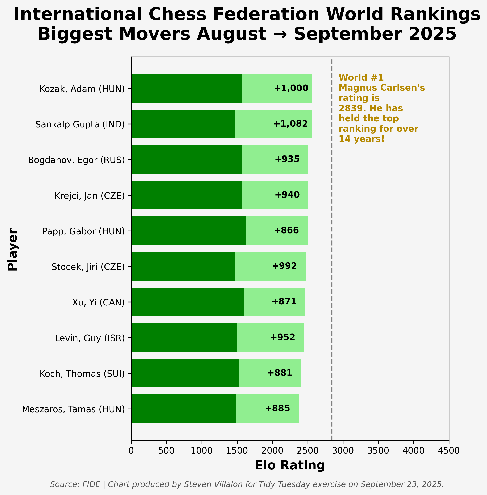

------------------------------------------------------------------------

{fig-alt="Final plot"}

## 1. Packages

```{python packages}
# Load packages
import pandas as pd
import numpy as np
import matplotlib.pyplot as plt
import warnings
import session_info

```

## 2. Load Data

```{python load_data}
# Load data
fide_ratings_august = pd.read_csv('https://raw.githubusercontent.com/rfordatascience/tidytuesday/main/data/2025/2025-09-23/fide_ratings_august.csv')
fide_ratings_september = pd.read_csv('https://raw.githubusercontent.com/rfordatascience/tidytuesday/main/data/2025/2025-09-23/fide_ratings_september.csv')

```

## 3. Examine Data

```{python examine1}
# Preview data
print("August Ratings")
fide_ratings_august.head()

```

```{python examine2}
# Preview data
print("September Ratings")
fide_ratings_september.head()

```

## 4. Cleaning

```{python cleaning1}
cols = ['name', 'fed', 'rating']

df1 = fide_ratings_august.query("sex == 'M'")[cols].copy()
df2 = fide_ratings_september.query("sex == 'M'")[cols].copy()

df = pd.merge(
    df1, df2,
    on='name',
    how='left',
    suffixes=('_aug', '_sep')
)

df = df.rename(columns={'fed_aug': 'federation'})
df = df.drop(columns=['fed_sep'])
df['chg'] = df['rating_sep'] - df['rating_aug']

df = df.sort_values(by='chg', ascending=False)

df = df.astype({
    'rating_aug': 'Int64',
    'rating_sep': 'Int64',
    'federation': 'category',
    'chg': 'Int64'
})

df_top10 = df.head(10)
df_top10 = df_top10.sort_values(by='rating_sep', ascending=False)
df_top10['label'] = (
    df_top10['name'].astype('string')
    .str.cat(df_top10['federation'].astype('string'), sep=' (')
    .add(')')
)
df_top10

```

Data is sorted by rating_sep descending.

## 5. Visualization

```{python visualization}
#| warning: false
#| message: false
#| output: false
#| fig-height: 8
#| fig-width: 8

# Plot setup
fig, ax = plt.subplots(figsize=(8, 8))
fig.patch.set_facecolor('#f5f5f5')
ax.set_facecolor('#f5f5f5')

# August rating bars
ax.barh(df_top10['label'], df_top10['rating_aug'], color='green')

# September improvement bars
ax.barh(df_top10['label'], df_top10['chg'], left=df_top10['rating_aug'], color='lightgreen')

# Bar labels
for y, aug, chg in zip(df_top10['label'], df_top10['rating_aug'], df_top10['chg']):
    xpos = aug + chg - 300
    ax.text(xpos, y, f"{chg:+,}", va='center', ha='center', color='black', fontsize=10, fontweight='bold')

# Vertical reference line
x_ref = df['rating_sep'].max()
top_player = df['name'][df['rating_sep']== x_ref].item()
first_last = " ".join(top_player.split(", ")[::-1])
ax.axvline(x=x_ref, color='gray', linestyle='--', linewidth=1.5)

# Annotation
ax.text(
    x_ref + 100,  # horizontal position
    1.5,           # vertical position
    f'World #1\n{first_last}\'s\nrating is\n{x_ref}. He has\nheld the top\nranking for over\n14 years!', 
    color='#b58900', 
    fontsize=10, 
    fontweight='bold')

# Caption
fig.text(
    0.5, 0.04,  # centered horizontally, just below the figure
    "Source: FIDE | Chart produced by Steven Villalon for Tidy Tuesday exercise on September 23, 2025.",
    ha="center", va="top",
    fontsize=9,
    color="#555555",
    style="italic"
)

# Labels and formatting
fig.subplots_adjust(top=0.88, bottom=0.12, left=0.27)
ax.set_xlabel('Elo Rating', fontsize=14, fontweight='bold', labelpad = 5)
ax.set_ylabel('Player', fontsize=14, fontweight='bold')
fig.suptitle('International Chess Federation World Rankings\nBiggest Movers August → September 2025', size = 20, weight='bold', y=0.98)
ax.set_xlim(0, 4500)
ax.invert_yaxis()

# Export
plt.savefig(
    "output/2025-09-23_tidy_tuesday_chess.png",
    dpi=300,
    bbox_inches="tight",
    facecolor=fig.get_facecolor() 
)

```

## 6. Export

```{python export}
#| warning: false
#| message: false
#| output: false

# Save visualization as png
# plt.savefig(
#     "output/2025-09-23_tidy_tuesday_chess.png",
#     dpi=300,
#     bbox_inches="tight",
#     facecolor=fig.get_facecolor() 
# )

```

## 7. Session Info

```{python session_info}
#| echo: false

# Show session and package info
warnings.filterwarnings("ignore", message="The '__version__' attribute is deprecated")
session_info.show()

```

## 8. Github

::: {.callout-tip title="Files"}
📓 <a href="https://github.com/stevenvillalon/portfolio/blob/main/TIDYTUESDAY/2025-09-23-CHESS/2025-09-23_tidy_tuesday_chess_O.qmd">View the notebook</a>

📁 <a href="https://github.com/stevenvillalon/portfolio/tree/main/TIDYTUESDAY" target="_blank" rel="noopener noreferrer">Full Repository</a>
:::
